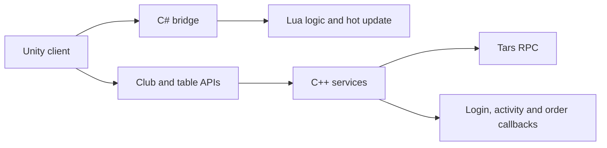

# Texas Hold'em Poker Club Source Code | Private Rooms and Multiplayer Tables

<p align="center"><strong>Unity / Lua client references · C++ / Tars server samples · Poker club table APIs · Build and hot-update documents</strong></p>

<p align="center"><a href="README.zh-CN.md">简体中文</a> · <a href="README.zh-TW.md">繁體中文</a> · <a href="README.en.md">English</a> · <a href="https://niubideren111.github.io/dezhou-poker-club-source-code/en/">Visual product page</a></p>

<p align="center"></p>

This repository presents source references and technical material for a **Texas Hold'em poker club, private-room and multiplayer-table product**. Public files include Unity/Lua client references, C++ server samples, Tars interfaces, poker-club table APIs, shell build scripts, Lua guidelines and a client hot-update document.

## Project highlights

| Area | Visible evidence | Useful for |
|---|---|---|
| Poker clubs and private rooms | Create/join club and club-table API examples | Club flows and private-table entry points |
| Multiplayer poker table | Seats, chips, pot, community cards and action controls | Mobile poker-table UX |
| Client references | Unity, C# and Lua-related files | Client and scripting-layer structure |
| Server samples | C++ services, asynchronous callbacks and Tars interfaces | Service and RPC organization |
| Build resources | Module build and cleanup shell scripts | Linux build entry points |

## Product screenshots

<table><tr>
<td width="33%" align="center"><a href="docs/assets/seo/dezhou-poker-club-source-code-01.jpg"></a><br><strong>Member account</strong><br>Profile and club-related entries</td>
<td width="33%" align="center"><a href="docs/assets/seo/dezhou-poker-club-source-code-02.jpg"></a><br><strong>Multiplayer table</strong><br>Seats, pot, board and betting controls</td>
<td width="33%" align="center"><a href="docs/assets/seo/dezhou-poker-club-source-code-03.jpg"></a><br><strong>Lobby and games</strong><br>Create, join, private-room and game filters</td>
</tr></table>

## Features and game references

| Module | Repository or screenshot evidence | Public scope |
|---|---|---|
| Create and join a club | `create_club` and `join_club` API examples | API documentation |
| Club table | `create_club_table` and table screenshot | API and product UI |
| Private room | Private-room, create and join entries in the lobby | Product UI |
| Classic Texas Hold'em | Two hole cards, five community cards and betting controls | Product UI |
| AOF, short deck, SNG, MTT and Omaha | Visible lobby filters | UI entry only; this does not claim all modules are publicly included |
| Login and user state | `AsyncLoginCallback` and related callback samples | C++ samples |
| Activity, order and goods | Tars interfaces and related source files | Interfaces and samples |
| Build and hot update | Shell scripts, hot-update flow and Lua guide | Scripts and documents |

## Technical architecture



## Source and documentation map

| File | Purpose |
|---|---|
| [`ActivityServant.tars`](ActivityServant.tars) | Activity service interface |
| [`external/AsyncLoginCallback.cpp`](external/AsyncLoginCallback.cpp) | Asynchronous login callback sample |
| [`all_build.sh`](all_build.sh) | Main server build entry point |
| [`SOURCE-INVENTORY.md`](SOURCE-INVENTORY.md) | Public source and document inventory |
| [`热更新流程.docx`](%E7%83%AD%E6%9B%B4%E6%96%B0%E6%B5%81%E7%A8%8B.docx) | Client hot-update flow |

```bash
git clone https://github.com/niubideren111/dezhou-poker-club-source-code.git
cd dezhou-poker-club-source-code
```

The repository publishes selected source samples, interfaces, scripts, documents and screenshots. A complete build still depends on the actual dependencies, assets, configuration and modules available to you.

## FAQ

**Is this a complete, ready-to-run poker platform?** The public material documents club and table APIs and parts of the service organization. The visible files alone should not be treated as a guaranteed full build.

**Where should server-side reading start?** Start with `ActivityServant.tars` and `SOURCE-INVENTORY.md`, then inspect `external` and the build scripts.

## License, security and contact

- License: [`LICENSE`](LICENSE) and [`License.md`](License.md)
- Security: [`SECURITY.md`](SECURITY.md)
- Telegram: [@fox_lovemyself](https://t.me/fox_lovemyself)

Do not commit production passwords, database credentials, signing keys, access tokens or real player data.
