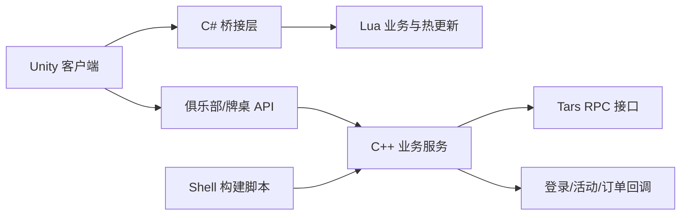

# 德州扑克俱乐部源码｜德州源码 |私人局、俱乐部与多人牌桌

<p align="center"><strong>Texas Hold'em Poker Club Source Code</strong><br>Unity / Lua 客户端资料 · C++ / Tars 服务端片段 · 俱乐部牌桌 API · 构建与热更新文档</p>

<p align="center"><a href="README.zh-CN.md">简体中文</a> · <a href="README.zh-TW.md">繁體中文</a> · <a href="README.en.md">English</a> · <a href="https://niubideren111.github.io/dezhou-poker-club-source-code/zh-cn/">图文产品页</a></p>

<p align="center"></p>

这是一个面向**德州扑克俱乐部、私人局和多人牌桌**场景的源码与技术资料仓库。公开内容包含 Unity/Lua 客户端资料、C++ 服务端代码片段、Tars 接口、俱乐部牌桌 API、构建脚本、Lua 规范与热更新文档。

> 搜索定位：德州扑克源码、德州俱乐部源码、德州扑克俱乐部源码、德州私人局源码、德州撲克源碼、Texas Hold'em source code、poker club source code。

## 项目亮点

| 方向 | 可见内容 | 适合了解 |
|---|---|---|
| 俱乐部与私人局 | 创建/加入俱乐部、创建俱乐部牌桌 API 与产品界面 | 俱乐部业务流程、私人牌桌入口 |
| 多人牌桌 | 座位、筹码、底池、下注状态、公共牌和操作区截图 | 移动端德州牌桌布局 |
| 客户端资料 | Unity、C#、Lua 相关文件及热更新文档 | 客户端与脚本层协作 |
| 服务端片段 | C++ 服务代码、异步回调与 Tars 接口 | 服务拆分和 RPC 接口组织 |
| 构建工具 | 公共库、游戏模块、服务模块构建与清理脚本 | Linux 编译入口与工程结构 |
| 多语言展示 | 简体中文、繁體中文、English README 与 Pages | 面向不同地区检索和阅读 |

## 产品截图

<table>
  <tr>
    <td width="33%" align="center"><a href="docs/assets/seo/dezhou-poker-club-source-code-01.jpg"></a><br><strong>会员与账户</strong><br>个人资料、账户入口及俱乐部相关功能</td>
    <td width="33%" align="center"><a href="docs/assets/seo/dezhou-poker-club-source-code-02.jpg"></a><br><strong>多人牌桌</strong><br>座位、底池、公共牌、下注与操作区</td>
    <td width="33%" align="center"><a href="docs/assets/seo/dezhou-poker-club-source-code-03.jpg"></a><br><strong>大厅与玩法</strong><br>创建、加入、私人房和玩法筛选入口</td>
  </tr>
</table>

## 主要功能与玩法

下表区分“仓库内有源码或接口证据”和“截图中可见的产品入口”，避免把展示页面误写成完整可编译模块。

| 模块 | 仓库或截图中的证据 | 公开范围 |
|---|---|---|
| 俱乐部创建与加入 | API 中的 `create_club`、`join_club` 请求/响应 | 接口资料 |
| 俱乐部牌桌 | `create_club_table` 接口及多人牌桌截图 | 接口资料与界面 |
| 私人房 | 大厅底部私人房入口、创建/加入入口 | 产品界面 |
| 经典德州扑克 | 多人桌、两张手牌、五张公共牌及下注操作 | 产品界面 |
| AOF、短牌、SNG、MTT、奥马哈等 | 大厅筛选项中可见 | 仅说明截图可见入口，不代表完整模块均已公开 |
| 登录与用户状态 | `AsyncLoginCallback`、查询、登出和状态回调片段 | C++ 代码片段 |
| 活动与奖励 | `ActivityServant.tars`、`ActivityServer.h`、宝箱相关文件 | 接口与代码片段 |
| 订单与商品 | 订单创建/更新、商品及兑换配置代码 | 代码片段 |
| 构建与清理 | `all_build.sh`、`build_servant.sh`、`build_comm.sh`、`build_clean.sh` | Shell 脚本 |
| 热更新与规范 | `热更新流程.docx`、`Lua编码规范.docx` | 开发文档 |

## 技术架构



| 层级 | 技术或资料 | 说明 |
|---|---|---|
| 客户端 | Unity、C# | 移动端界面与引擎层资料 |
| 脚本层 | Lua | 业务脚本、编码规范与热更新流程 |
| 服务端 | C++ | 登录、活动、订单、路由和异步回调片段 |
| RPC | Tars | 服务定义与接口组织 |
| 构建 | Shell | 公共库、游戏模块和服务模块构建入口 |

## 源码与资料入口

| 文件或目录 | 用途 |
|---|---|
| [`ActivityServant.tars`](ActivityServant.tars) | 活动服务接口定义 |
| [`ActivityServer.h`](ActivityServer.h) | 活动服务声明 |
| [`external/AsyncLoginCallback.cpp`](external/AsyncLoginCallback.cpp) | 登录异步回调代码片段 |
| [`all_build.sh`](all_build.sh) | 服务端构建总入口 |
| [`build_comm.sh`](build_comm.sh) | 公共库构建脚本 |
| [`build_servant.sh`](build_servant.sh) | 服务模块构建脚本 |
| [`SOURCE-INVENTORY.md`](SOURCE-INVENTORY.md) | 公开源码与资料索引 |
| [`热更新流程.docx`](%E7%83%AD%E6%9B%B4%E6%96%B0%E6%B5%81%E7%A8%8B.docx) | 客户端热更新流程 |
| [`Lua编码规范.docx`](Lua%E7%BC%96%E7%A0%81%E8%A7%84%E8%8C%83.docx) | Lua 开发规范 |

## 获取项目

```bash
git clone https://github.com/niubideren111/dezhou-poker-club-source-code.git
cd dezhou-poker-club-source-code
```

该仓库公开的是源码片段、接口、脚本、开发文档和产品截图。能否独立编译运行应以实际依赖、资源、配置和未公开模块为准。请先阅读 [`SOURCE-INVENTORY.md`](SOURCE-INVENTORY.md) 和许可证。

## 常见问题

### 这是完整、开箱即用的德州扑克工程吗？

仓库公开内容可以用于了解俱乐部、牌桌接口和服务组织，但不能仅凭当前公开文件承诺完整构建。README 会明确区分公开代码、产品截图和未公开依赖。

### 这是德州俱乐部源码还是私人局源码？

产品界面同时包含俱乐部、创建/加入牌局和私人房入口；公开 API 重点覆盖俱乐部创建、加入及俱乐部牌桌。

### 从哪里开始阅读服务端？

先看 `ActivityServant.tars` 和 `SOURCE-INVENTORY.md`，再阅读 `external` 目录与构建脚本。

### 如何查看图文页面？

访问 [GitHub Pages 简体中文页面](https://niubideren111.github.io/dezhou-poker-club-source-code/zh-cn/)，也可切换繁體中文和 English。

## 许可、安全与联系

- 许可：[`LICENSE`](LICENSE) 与 [`License.md`](License.md)
- 安全问题：[`SECURITY.md`](SECURITY.md)
- 贡献说明：[`CONTRIBUTING.md`](CONTRIBUTING.md)
- Telegram：[@fox_lovemyself](https://t.me/fox_lovemyself)

请勿提交生产密码、数据库连接、签名私钥、访问令牌或真实玩家数据。产品素材、第三方资源与完整交付范围应分别确认授权。

## 相关项目

- [Texas-Hold-em-source-code](https://github.com/niubideren111/Texas-Hold-em-source-code)
- [Texas-Hold-em-Tournament-Source-Code](https://github.com/niubideren111/Texas-Hold-em-Tournament-Source-Code)
