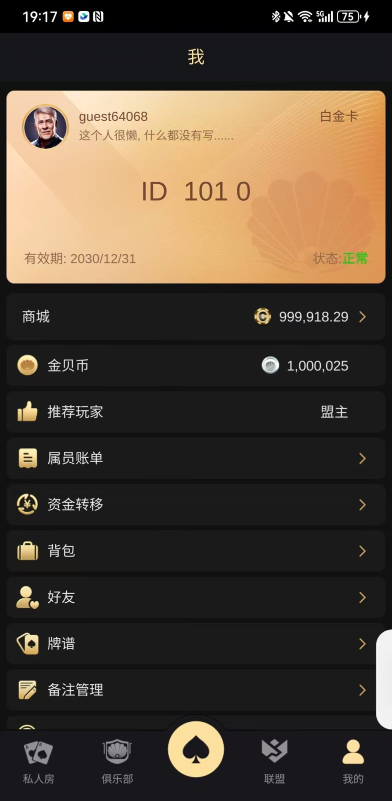
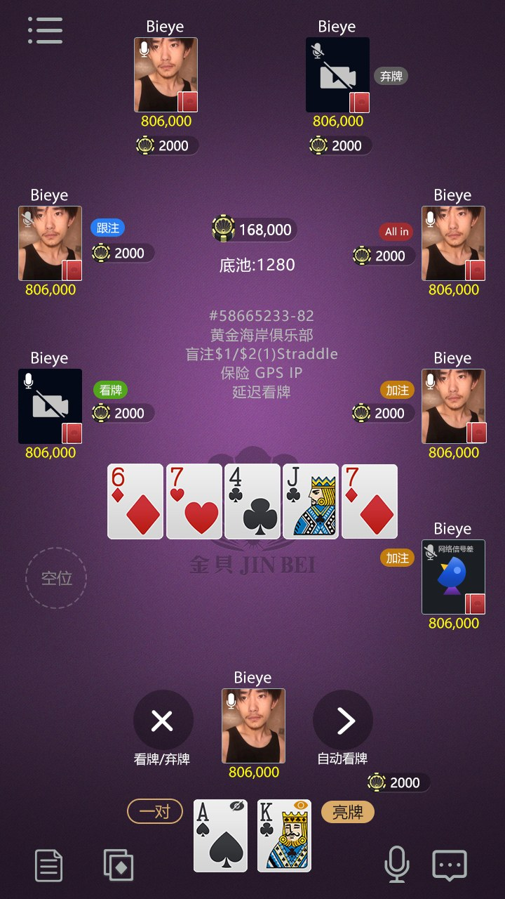
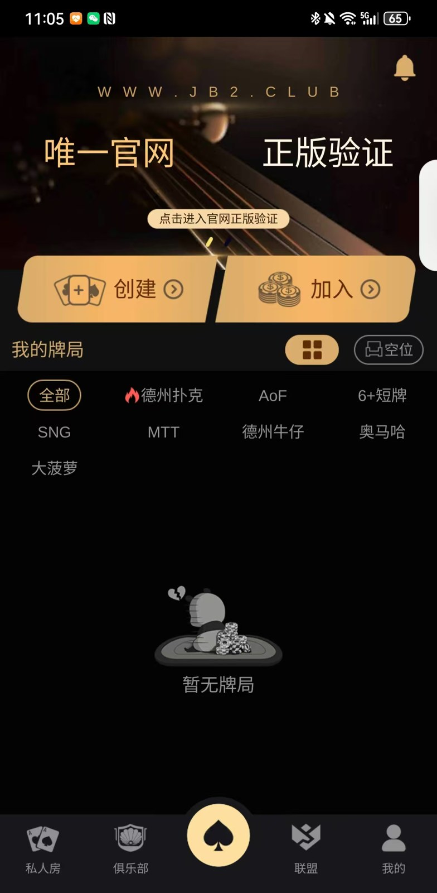

# 德州俱乐部源码｜Unity、C++ 与联盟系统资料

[简体中文](README.zh-CN.md) · [繁體中文](README.zh-TW.md) · [English](README.en.md) · [产品页面](https://niubideren111.github.io/dezhou-poker-club-source-code/zh-cn/)

面向俱乐部与联盟场景的德州扑克项目，展示会员入口、牌桌对局和俱乐部相关界面。公开文件包括 C++ 服务端片段、Tars 接口、构建脚本与 Lua 开发文档，可用于理解 Unity 与服务器项目的协作方式。

**德州俱乐部源码 · 德州扑克俱乐部源码 · 德州联盟源码 · Unity德州源码**

## 项目重点

### 俱乐部与联盟定位

聚焦社交牌桌和俱乐部产品组织，区别于金币大厅和单独的锦标赛项目。

### 服务接口与回调

通过 ActivityServant.tars 和 external 下的异步回调文件查看接口组织方式。

### 构建与团队协作

提供基础库、游戏动态库等构建脚本，以及 Lua 编码和热更新相关文档。

## 资料阅读与核对方式

1. **先确认产品形态**：依次查看截图和图注，确认产品类型与可见功能流程。
2. **再核对文件证据**：直接打开下方列出的源码或文档，不只依赖功能描述。
3. **检查可构建范围**：确认准备运行的部分是否具备依赖、资源、配置和启动脚本。
4. **确认授权**：阅读仓库许可；商业素材及完整工程交付应另行取得书面授权。

## 产品截图







## 公开源码与资料

| 文件 | 说明 |
|---|---|
| [ActivityServant.tars](ActivityServant.tars) | 活动服务接口定义 |
| [external/AsyncLoginCallback.cpp](external/AsyncLoginCallback.cpp) | 登录异步回调片段 |
| [all_build.sh](all_build.sh) | 服务端构建脚本入口 |
| [build_comm.sh](build_comm.sh) | 基础库构建脚本 |
| [热更新流程.docx](%E7%83%AD%E6%9B%B4%E6%96%B0%E6%B5%81%E7%A8%8B.docx) | 热更新流程文档 |

## 开始阅读

```bash
git clone https://github.com/niubideren111/dezhou-poker-club-source-code.git
cd dezhou-poker-club-source-code
```

## 常见问题

### 与其他德州项目有什么区别？

本仓库重点是俱乐部、联盟及社交牌桌；大厅玩法和独立赛事展示分别由其他项目承载。

### 从哪个文件开始了解服务器？

先查看 ActivityServant.tars 的接口，再阅读 external 目录中的异步登录回调与构建脚本。

## 后续资料完善方向

按真实服务划分补充登录、大厅、俱乐部、联盟和游戏服务的依赖图；展示可公开的协议示例，不上传生产连接配置。 后续更新还应加入版本化依赖清单、经过验证的构建或导入步骤、简明架构/产品流程图，以及能对应真实文件变化的版本记录。大型授权资源可放入 GitHub Releases 并提供校验值，不能提交密钥、生产地址或用户数据。

## 相关项目

- [Texas-Hold-em-source-code](https://github.com/niubideren111/Texas-Hold-em-source-code)
- [Texas-Hold-em-Tournament-Source-Code](https://github.com/niubideren111/Texas-Hold-em-Tournament-Source-Code)

## 资料范围与许可

公开内容包括服务端片段、构建脚本、开发文档及产品截图；完整客户端、服务端与数据库的交付内容通过项目联系方式沟通。 公开内容以实际文件、依赖和许可为准，不承诺搜索排名、直接上线或固定性能结果。

- Telegram: [@fox_lovemyself](https://t.me/fox_lovemyself)
- GitHub: [dezhou-poker-club-source-code](https://github.com/niubideren111/dezhou-poker-club-source-code)
