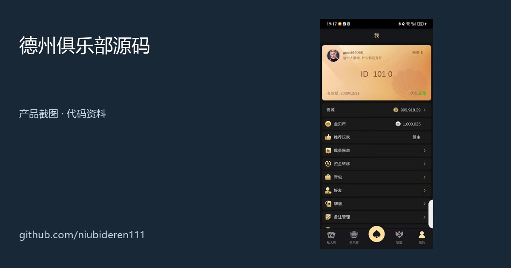
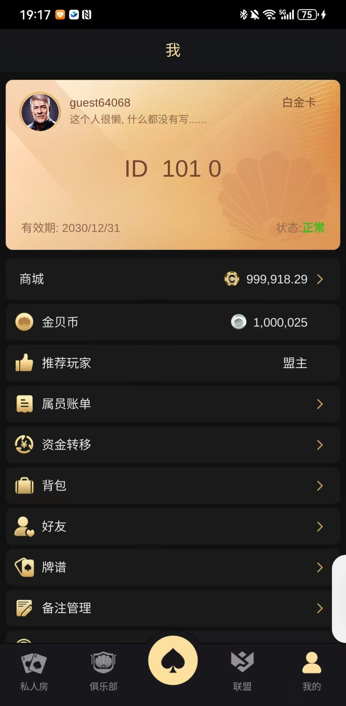
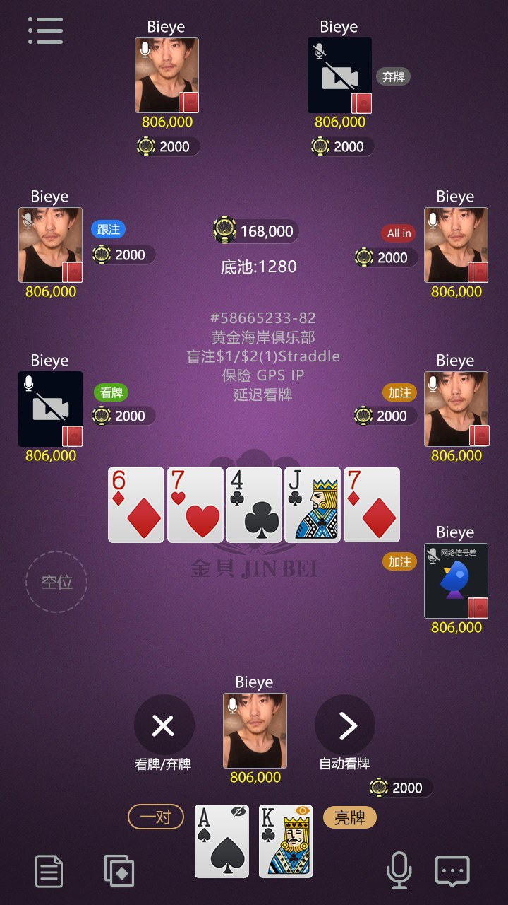
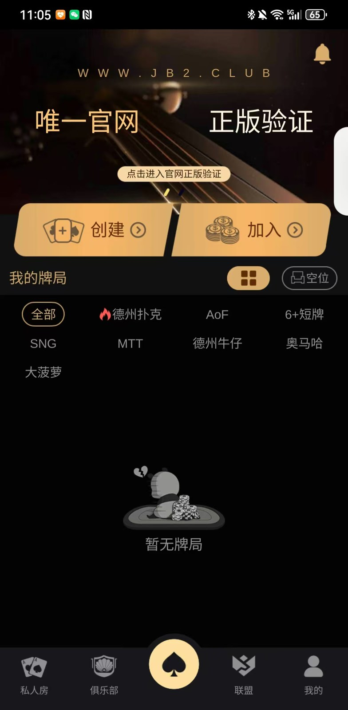
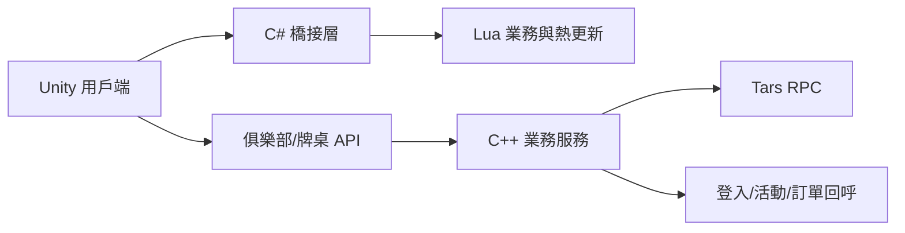

# 德州撲克俱樂部原始碼｜私人局、俱樂部與多人牌桌

<p align="center"><strong>Texas Hold'em Poker Club Source Code</strong><br>Unity / Lua 用戶端資料 · C++ / Tars 伺服器片段 · 俱樂部牌桌 API · 建置與熱更新文件</p>

<p align="center"><a href="README.zh-CN.md">簡體中文</a> · <a href="README.zh-TW.md">繁體中文</a> · <a href="README.en.md">English</a> · <a href="https://niubideren111.github.io/dezhou-poker-club-source-code/zh-tw/">圖文產品頁</a></p>

<p align="center"></p>

這是一個面向**德州撲克俱樂部、私人局與多人牌桌**場景的原始碼和技術資料倉庫。公開內容包含 Unity/Lua 用戶端資料、C++ 伺服器程式片段、Tars 介面、俱樂部牌桌 API、建置腳本、Lua 規範與熱更新文件。

> 搜尋定位：德州撲克原始碼、德州俱樂部原始碼、德州撲克俱樂部原始碼、德州私人局原始碼、Texas Hold'em source code、poker club source code。

## 專案亮點

| 方向 | 可見內容 | 適合瞭解 |
|---|---|---|
| 俱樂部與私人局 | 建立/加入俱樂部、建立俱樂部牌桌 API 與產品介面 | 俱樂部流程、私人牌桌入口 |
| 多人牌桌 | 座位、籌碼、底池、下注狀態、公牌與操作區截圖 | 行動端德州牌桌配置 |
| 用戶端資料 | Unity、C#、Lua 相關檔案及熱更新文件 | 用戶端與腳本層協作 |
| 伺服器片段 | C++ 服務程式、非同步回呼與 Tars 介面 | 服務拆分與 RPC 組織 |
| 建置工具 | 公共庫、遊戲模組、服務模組建置及清理腳本 | Linux 編譯入口 |

## 產品截圖

<table><tr>
<td width="33%" align="center"><a href="docs/assets/seo/dezhou-poker-club-source-code-01.jpg"></a><br><strong>會員與帳戶</strong><br>個人資料及俱樂部功能</td>
<td width="33%" align="center"><a href="docs/assets/seo/dezhou-poker-club-source-code-02.jpg"></a><br><strong>多人牌桌</strong><br>座位、底池、公牌與下注操作</td>
<td width="33%" align="center"><a href="docs/assets/seo/dezhou-poker-club-source-code-03.jpg"></a><br><strong>大廳與玩法</strong><br>建立、加入、私人房與玩法入口</td>
</tr></table>

## 主要功能與玩法

| 模組 | 倉庫或截圖中的依據 | 公開範圍 |
|---|---|---|
| 建立與加入俱樂部 | API 中的 `create_club`、`join_club` | 介面資料 |
| 俱樂部牌桌 | `create_club_table` 與牌桌截圖 | 介面資料與畫面 |
| 私人房 | 大廳私人房、建立與加入入口 | 產品畫面 |
| 經典德州撲克 | 兩張底牌、五張公牌與下注操作 | 產品畫面 |
| AOF、短牌、SNG、MTT、奧馬哈等 | 大廳篩選項可見 | 僅表示畫面中有入口，不代表完整模組均已公開 |
| 登入與使用者狀態 | `AsyncLoginCallback` 等回呼片段 | C++ 程式片段 |
| 活動、訂單與商品 | Tars 介面與相關程式檔 | 介面與程式片段 |
| 建置與熱更新 | Shell 腳本、熱更新流程、Lua 規範 | 腳本與文件 |

## 技術架構



## 原始碼與資料入口

| 檔案 | 用途 |
|---|---|
| [`ActivityServant.tars`](ActivityServant.tars) | 活動服務介面 |
| [`external/AsyncLoginCallback.cpp`](external/AsyncLoginCallback.cpp) | 登入非同步回呼片段 |
| [`all_build.sh`](all_build.sh) | 伺服器建置總入口 |
| [`SOURCE-INVENTORY.md`](SOURCE-INVENTORY.md) | 公開資料索引 |
| [`熱更新流程.docx`](%E7%83%AD%E6%9B%B4%E6%96%B0%E6%B5%81%E7%A8%8B.docx) | 用戶端熱更新流程 |

```bash
git clone https://github.com/niubideren111/dezhou-poker-club-source-code.git
cd dezhou-poker-club-source-code
```

本倉庫公開的是程式片段、介面、腳本、開發文件和產品截圖。能否獨立建置，應以實際相依套件、資源、設定與未公開模組為準。

## 常見問題

**這是完整且可直接執行的工程嗎？** 目前公開資料適合瞭解俱樂部、牌桌介面和服務組織；不能只憑公開檔案承諾完整建置。

**從哪裡開始看伺服器？** 先看 `ActivityServant.tars` 與 `SOURCE-INVENTORY.md`，再閱讀 `external` 和建置腳本。

## 授權、安全與聯絡

- 授權：[`LICENSE`](LICENSE) 與 [`License.md`](License.md)
- 安全：[`SECURITY.md`](SECURITY.md)
- Telegram：[@fox_lovemyself](https://t.me/fox_lovemyself)

請勿提交正式環境密碼、資料庫連線、私鑰、Token 或真實玩家資料。
